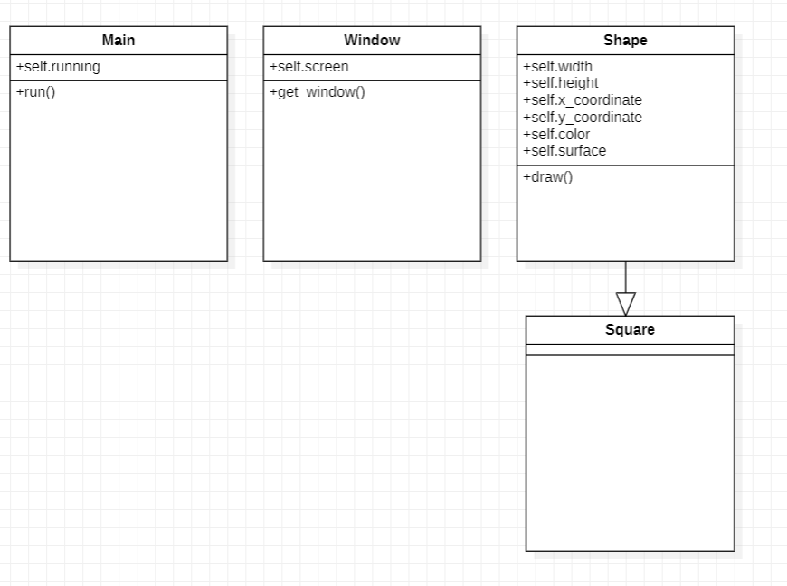

# simple_pygame_demo
A very very simple pygame demo

## UML of the demo

How to run:

 - Create virtual environment in the project folder
 - Activate virtual environment
 - Install pygame with pip
 - run run.py
 - have fun with looking at this art piece